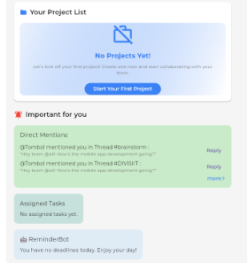

# TaskVerse BETA 0.5

TaskVerse adalah aplikasi _modular collaborative productivity_ berbasis Flutter. Aplikasi ini dirancang untuk membantu pengguna mengelola tugas pribadi dan proyek tim secara kolaboratif, lengkap dengan sistem komunikasi ala Slack/Discord.

## ✨ Fitur Utama

- ✅ Halaman Home dengan widget Reminder dan What's Going On
- ✅ Manajemen Personal Task (Deadline & Daily Activity)
- ✅ Manajemen Project Task dan integrasi Thread Project
- ✅ Thread Page (create thread & subthread HQ dan Project)
- ✅ Halaman Profil (ubah nama)
- ✅ Autentikasi Login & Register (via backend PHP sederhana)

## 📸 Cuplikan Antarmuka (Screenshots)

### Home Page

### TaskRoom

### Thread Page

> **Catatan**: Gambar akan muncul jika diletakkan di folder `screenshots/` dalam repo ini. Silakan sesuaikan nama file dan folder sesuai kebutuhanmu.

## ⚙️ Teknologi yang Digunakan

- **Flutter (Dart)** — UI/UX
- **Provider** — State Management
- **PHP (Planned)** — Backend sederhana
- **Figma** — UI Wireframe

## 🚧 Status Pengembangan

- [x] UI utama selesai (Home, Task, Thread, Profile)
- [x] Fungsi utama Personal & Project Task
- [x] Sistem Thread & Chat
- [x] Dummy Logic Reminder & Notifikasi
- [ ] Backend penuh belum tersedia (hanya login/register)

## 👥 Kontributor

- Rahmat Fauzan – 1303220170  
- Ach Disya Milcky – 1303220048  
- Muhammad Rizki Ilahi – 1303220094  
- Adrian Rifqi Ghifari – 1303220035
- Cholilur Rahman – 1303223105

---

